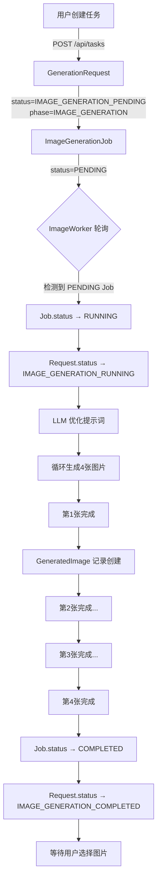
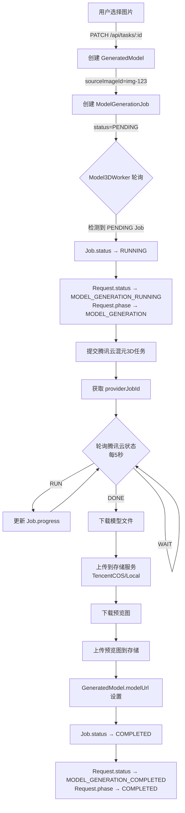

# Lumi Web Next - 系统架构与状态流转详解

## 📋 目录
- [核心概念](#核心概念)
- [Status vs Phase](#status-vs-phase)
- [四层架构](#四层架构)
- [完整状态流转](#完整状态流转)
- [Worker 协作机制](#worker-协作机制)
- [数据流图](#数据流图)

---

## 🎯 核心概念

### Status（状态）vs Phase（阶段）

#### `status` - 业务状态（细粒度）
**定义**：描述 GenerationRequest 当前的**具体执行状态**

**枚举值**（共 11 个）：
```typescript
enum RequestStatus {
  // 图片生成阶段（4个状态）
  IMAGE_PENDING                 // ⏳ 图片生成：等待开始
  IMAGE_GENERATING              // 🔄 图片生成：执行中
  IMAGE_COMPLETED               // ✅ 图片生成：已完成，等待用户选择
  IMAGE_FAILED                  // ❌ 图片生成：失败

  // 模型生成阶段（4个状态）
  MODEL_PENDING                 // ⏳ 模型生成：等待开始
  MODEL_GENERATING              // 🔄 模型生成：执行中
  MODEL_COMPLETED               // ✅ 模型生成：已完成
  MODEL_FAILED                  // ❌ 模型生成：失败

  // 终态（3个状态）
  COMPLETED                     // ✅ 请求完成（至少生成了一个模型）
  FAILED                        // ❌ 请求失败
  CANCELLED                     // 🚫 用户取消
}
```

**用途**：
- Worker 用于判断是否需要处理
- 前端用于展示详细进度
- API 用于返回当前执行情况

#### `phase` - 业务阶段（粗粒度）
**定义**：描述 GenerationRequest 当前处于**哪个业务阶段**

**枚举值**（共 4 个）：
```typescript
enum RequestPhase {
  IMAGE_GENERATION   // 📸 图片生成阶段
  AWAITING_SELECTION // ⏸️  等待用户选择图片
  MODEL_GENERATION   // 🎨 模型生成阶段
  COMPLETED          // ✅ 已完成
}
```

**用途**：
- 数据库索引优化（快速筛选阶段）
- 业务统计（各阶段任务数量）
- 简化前端判断逻辑

#### 对比示例

| 场景 | status | phase | 说明 |
|------|--------|-------|------|
| 用户刚创建任务 | `IMAGE_PENDING` | `IMAGE_GENERATION` | 图片生成阶段，等待 Worker 处理 |
| Worker 正在生成第2张图 | `IMAGE_GENERATING` | `IMAGE_GENERATION` | 图片生成阶段，执行中 |
| 4张图片已生成完成 | `IMAGE_COMPLETED` | `AWAITING_SELECTION` | 等待用户选图 |
| 用户选图后触发3D生成 | `MODEL_PENDING` | `MODEL_GENERATION` | 模型生成阶段，等待 Worker 处理 |
| Worker 正在生成3D模型 | `MODEL_GENERATING` | `MODEL_GENERATION` | 模型生成阶段，执行中 |
| 模型生成完成 | `MODEL_COMPLETED` | `COMPLETED` | 已完成 |

---

## 🏗️ 四层架构

### 架构分层

```
┌─────────────────────────────────────────────────┐
│  业务层（用户视角）                               │
│  GenerationRequest - 用户的生成请求（聚合根）      │
│    ├─ GeneratedImage[] - 生成的图片               │
│    └─ GeneratedModel[] - 生成的模型               │
└─────────────────────────────────────────────────┘
                      ↕️
┌─────────────────────────────────────────────────┐
│  执行层（Worker视角）                             │
│  Job - 队列中的任务单元                           │
│    ├─ ImageGenerationJob (1:1 with Request)     │
│    └─ ModelGenerationJob (1:1 with Model)       │
└─────────────────────────────────────────────────┘
                      ↕️
┌─────────────────────────────────────────────────┐
│  配置层                                          │
│  QueueConfig - 动态队列配置                       │
│    ├─ maxConcurrency - 最大并发数                │
│    ├─ jobTimeout - 超时时间                      │
│    └─ retryStrategy - 重试策略                    │
└─────────────────────────────────────────────────┘
                      ↕️
┌─────────────────────────────────────────────────┐
│  Provider层                                      │
│    ├─ ImageProvider (SiliconFlow/Aliyun)        │
│    ├─ Model3DProvider (Tencent Hunyuan)         │
│    ├─ LLMProvider (SiliconFlow DeepSeek/Qwen)   │
│    └─ StorageProvider (TencentCOS/Local)        │
└─────────────────────────────────────────────────┘
```

### 关系图

```
User (1:N) GenerationRequest
    ↓ (1:1)
ImageGenerationJob
    ↓
GeneratedImage[] (1:N)
    ↓ (1:1 可选)
GeneratedModel
    ↓ (1:1)
ModelGenerationJob
```

---

## 🔄 完整状态流转

### 阶段1：图片生成流程



**数据库变化记录**：
```sql
-- 1. 创建时
INSERT INTO GenerationRequest (status, phase)
VALUES ('IMAGE_GENERATION_PENDING', 'IMAGE_GENERATION');

INSERT INTO ImageGenerationJob (requestId, status)
VALUES ('req-123', 'PENDING');

-- 2. Worker 开始处理
UPDATE ImageGenerationJob SET status='RUNNING', startedAt=NOW();
UPDATE GenerationRequest SET status='IMAGE_GENERATION_RUNNING';

-- 3. 每生成一张图片
INSERT INTO GeneratedImage (requestId, index, url)
VALUES ('req-123', 0, 'https://...');

-- 4. 全部完成
UPDATE ImageGenerationJob SET status='COMPLETED', completedAt=NOW();
UPDATE GenerationRequest SET status='IMAGE_GENERATION_COMPLETED';
```

### 阶段2：3D 模型生成流程



**数据库变化记录**：
```sql
-- 1. 用户选择图片
UPDATE GenerationRequest
SET status='MODEL_GENERATION_PENDING', phase='MODEL_GENERATION';

INSERT INTO GeneratedModel (requestId, sourceImageId, name)
VALUES ('req-123', 'img-123', 'model.obj');

INSERT INTO ModelGenerationJob (modelId, status)
VALUES ('model-123', 'PENDING');

-- 2. Worker 开始处理
UPDATE ModelGenerationJob SET status='RUNNING', startedAt=NOW();
UPDATE GenerationRequest SET status='MODEL_GENERATION_RUNNING';

-- 3. 轮询中更新进度
UPDATE ModelGenerationJob SET progress=30 WHERE id='job-123';
UPDATE ModelGenerationJob SET progress=60 WHERE id='job-123';
UPDATE ModelGenerationJob SET progress=90 WHERE id='job-123';

-- 4. 模型下载完成
UPDATE GeneratedModel
SET modelUrl='https://...', previewImageUrl='https://...', completedAt=NOW();

UPDATE ModelGenerationJob SET status='COMPLETED', progress=100, completedAt=NOW();

UPDATE GenerationRequest
SET status='MODEL_GENERATION_COMPLETED', phase='COMPLETED', completedAt=NOW();
```

---

## ⚙️ Worker 协作机制

### ImageWorker（图片生成 Worker）

**监听条件**：
```typescript
WHERE status = 'IMAGE_GENERATION_PENDING'
  AND (Job.status = 'PENDING' OR Job.status = 'RETRYING')
ORDER BY priority DESC, createdAt ASC
LIMIT maxConcurrency
```

**处理流程**：
```typescript
async function processImageGenerationJob(job: ImageGenerationJob) {
  // 1. 更新状态
  await updateJob(job.id, { status: 'RUNNING', startedAt: now() });
  await updateRequest(job.requestId, { status: 'IMAGE_GENERATION_RUNNING' });

  // 2. LLM 优化提示词（生成4个风格变体）
  const variants = await llmProvider.generatePromptVariants(request.prompt);

  // 3. 断点续传：检查已生成的图片数量
  const existingImages = await getGeneratedImages(request.id);
  const remainingCount = 4 - existingImages.length;

  // 4. 循环生成剩余图片
  for (let i = existingImages.length; i < 4; i++) {
    const imageUrl = await imageProvider.generateImage(variants[i]);

    // 下载并上传到存储服务
    const storageUrl = await downloadAndUploadImage(request.id, i, imageUrl);

    // 创建数据库记录
    await createGeneratedImage({
      requestId: request.id,
      index: i,
      url: storageUrl,
      prompt: variants[i]
    });
  }

  // 5. 全部完成
  await updateJob(job.id, { status: 'COMPLETED', progress: 100 });
  await updateRequest(job.requestId, { status: 'IMAGE_GENERATION_COMPLETED' });
}
```

**重试机制**：
- 普通错误：立即重试（延迟 2 秒）
- 限流错误：延迟 30 秒后重试
- 最大重试 3 次

**并发控制**：
- 从 QueueConfig 读取 `maxConcurrency`（默认 3）
- 每 2 秒轮询一次
- 最多同时处理 3 个任务

### Model3DWorker（3D 模型生成 Worker）

**监听条件**：
```typescript
WHERE status = 'MODEL_GENERATION_PENDING'
  AND (Job.status = 'PENDING' OR Job.status = 'RETRYING')
ORDER BY priority DESC, createdAt ASC
LIMIT maxConcurrency
```

**处理流程**：
```typescript
async function processModelGenerationJob(job: ModelGenerationJob) {
  // 1. 更新状态
  await updateJob(job.id, { status: 'RUNNING', startedAt: now() });
  await updateRequest(model.requestId, {
    status: 'MODEL_GENERATION_RUNNING',
    phase: 'MODEL_GENERATION'
  });

  // 2. 获取源图片 URL
  const sourceImage = await getGeneratedImage(model.sourceImageId);

  // 3. 提交腾讯云混元3D任务
  const { jobId } = await model3DProvider.submitModelGenerationJob({
    imageUrl: sourceImage.url
  });

  await updateJob(job.id, { providerJobId: jobId });

  // 4. 轮询腾讯云状态（每 5 秒，最多 10 分钟）
  let finalStatus: 'DONE' | 'FAIL';
  const startTime = Date.now();

  while (Date.now() - startTime < 600000) { // 10分钟
    const { status, progress } = await model3DProvider.queryModelTaskStatus(jobId);

    // 更新进度
    await updateJob(job.id, {
      progress: calculateProgress(Date.now() - startTime)
    });

    if (status === 'DONE' || status === 'FAIL') {
      finalStatus = status;
      break;
    }

    await sleep(5000); // 等待 5 秒
  }

  // 5. 下载模型文件和预览图
  if (finalStatus === 'DONE') {
    const modelBuffer = await downloadModel(response.modelUrl);
    const previewBuffer = await downloadImage(response.previewUrl);

    const modelStorageUrl = await storageProvider.saveModel(modelBuffer);
    const previewStorageUrl = await storageProvider.saveImage(previewBuffer);

    // 6. 更新模型记录
    await updateGeneratedModel(model.id, {
      modelUrl: modelStorageUrl,
      previewImageUrl: previewStorageUrl,
      completedAt: now()
    });

    // 7. 更新状态
    await updateJob(job.id, { status: 'COMPLETED', progress: 100 });
    await updateRequest(model.requestId, {
      status: 'MODEL_GENERATION_COMPLETED',
      phase: 'COMPLETED',
      completedAt: now()
    });
  } else {
    // 失败处理
    await updateJob(job.id, { status: 'FAILED' });
    await updateRequest(model.requestId, { status: 'MODEL_GENERATION_FAILED' });
  }
}
```

**并发控制**：
- 从 QueueConfig 读取 `maxConcurrency`（默认 1）
- 每 2 秒轮询一次
- 最多同时处理 1 个任务（3D 生成耗时长）

---

## 📊 数据流图

### 完整数据流（从用户输入到模型生成完成）

```
┌─────────────────┐
│   用户输入      │
│ "一只可爱的猫"  │
└────────┬────────┘
         │
         ↓
┌────────────────────────────────────────┐
│  POST /api/tasks                       │
│  创建 GenerationRequest + Job          │
│    status: IMAGE_GENERATION_PENDING   │
│    phase:  IMAGE_GENERATION           │
└────────┬───────────────────────────────┘
         │
         ↓
┌────────────────────────────────────────┐
│  ImageWorker (每2秒轮询)                │
│  检测: ImageGenerationJob.status       │
│       = PENDING                        │
└────────┬───────────────────────────────┘
         │
         ↓
┌────────────────────────────────────────┐
│  1. Job.status → RUNNING               │
│  2. Request.status →                   │
│     IMAGE_GENERATION_RUNNING           │
└────────┬───────────────────────────────┘
         │
         ↓
┌────────────────────────────────────────┐
│  LLM Provider (提示词优化)              │
│  输入: "一只可爱的猫"                   │
│  输出: 4个风格变体                     │
│    - 写实风格猫摆件                     │
│    - 卡通Q版猫玩偶                      │
│    - 几何抽象猫雕塑                     │
│    - 日式招福猫造型                     │
└────────┬───────────────────────────────┘
         │
         ↓
┌────────────────────────────────────────┐
│  Image Provider (SiliconFlow)          │
│  循环生成 4 张图片                      │
│    每生成1张 → GeneratedImage 记录     │
└────────┬───────────────────────────────┘
         │
         ↓
┌────────────────────────────────────────┐
│  Storage Provider (腾讯云COS)           │
│  下载远程图片 → 上传到COS               │
│  更新 GeneratedImage.url               │
└────────┬───────────────────────────────┘
         │
         ↓
┌────────────────────────────────────────┐
│  全部图片完成                           │
│  1. Job.status → COMPLETED             │
│  2. Request.status →                   │
│     IMAGE_GENERATION_COMPLETED         │
└────────┬───────────────────────────────┘
         │
         ↓
┌────────────────────────────────────────┐
│  前端轮询获取任务状态                   │
│  GET /api/tasks/:id                    │
│  展示 4 张图片，等待用户选择            │
└────────┬───────────────────────────────┘
         │
         ↓
┌────────────────────────────────────────┐
│  用户选择第2张图片                      │
│  PATCH /api/tasks/:id                  │
│  { selectedImageIndex: 1 }             │
└────────┬───────────────────────────────┘
         │
         ↓
┌────────────────────────────────────────┐
│  创建 GeneratedModel +                 │
│       ModelGenerationJob               │
│    status: MODEL_GENERATION_PENDING   │
│    phase:  MODEL_GENERATION           │
└────────┬───────────────────────────────┘
         │
         ↓
┌────────────────────────────────────────┐
│  Model3DWorker (每2秒轮询)              │
│  检测: ModelGenerationJob.status       │
│       = PENDING                        │
└────────┬───────────────────────────────┘
         │
         ↓
┌────────────────────────────────────────┐
│  1. Job.status → RUNNING               │
│  2. Request.status →                   │
│     MODEL_GENERATION_RUNNING           │
│  3. Request.phase →                    │
│     MODEL_GENERATION                   │
└────────┬───────────────────────────────┘
         │
         ↓
┌────────────────────────────────────────┐
│  Model3D Provider (腾讯云混元3D)        │
│  提交任务 → 获取 providerJobId         │
└────────┬───────────────────────────────┘
         │
         ↓
┌────────────────────────────────────────┐
│  轮询腾讯云状态 (每5秒)                 │
│    WAIT → RUN → DONE                   │
│  同时更新 Job.progress                 │
│    0% → 30% → 60% → 90% → 100%         │
└────────┬───────────────────────────────┘
         │
         ↓
┌────────────────────────────────────────┐
│  下载模型文件 (.obj + .mtl + 纹理)      │
│  下载预览图 (.png)                      │
└────────┬───────────────────────────────┘
         │
         ↓
┌────────────────────────────────────────┐
│  Storage Provider (腾讯云COS)           │
│  上传模型文件 → 获取永久URL             │
│  上传预览图   → 获取永久URL             │
└────────┬───────────────────────────────┘
         │
         ↓
┌────────────────────────────────────────┐
│  更新 GeneratedModel                   │
│    modelUrl: "https://cos.../model.obj"│
│    previewImageUrl: "https://cos..."   │
│    completedAt: NOW()                  │
└────────┬───────────────────────────────┘
         │
         ↓
┌────────────────────────────────────────┐
│  全部完成                               │
│  1. Job.status → COMPLETED             │
│  2. Request.status →                   │
│     MODEL_GENERATION_COMPLETED         │
│  3. Request.phase → COMPLETED          │
│  4. Request.completedAt → NOW()        │
└────────┬───────────────────────────────┘
         │
         ↓
┌────────────────────────────────────────┐
│  前端轮询获取任务状态                   │
│  GET /api/tasks/:id                    │
│  展示 3D 模型预览 + 下载按钮            │
└────────────────────────────────────────┘
```

---

## 🎯 总结

### Status（状态）
- **作用**：描述任务的**具体执行状态**
- **粒度**：细粒度（12 个枚举值）
- **用途**：Worker 判断、前端展示、API 返回

### Phase（阶段）
- **作用**：描述任务所处的**业务阶段**
- **粒度**：粗粒度（3 个枚举值）
- **用途**：数据库索引、业务统计、简化判断

### Job（任务单元）
- **作用**：队列中的**可执行单元**
- **特点**：独立的生命周期、重试机制、超时控制
- **关系**：
  - ImageGenerationJob (1:1 with GenerationRequest)
  - ModelGenerationJob (1:1 with GeneratedModel)

### Worker（后台处理器）
- **ImageWorker**：监听图片生成任务，生成 4 张图片
- **Model3DWorker**：监听模型生成任务，生成 3D 模型
- **特点**：自动轮询、断点续传、重试机制、并发控制

### 核心设计理念
1. **业务与执行分离**：GenerationRequest（业务层）+ Job（执行层）
2. **状态双轨制**：status（细粒度）+ phase（粗粒度）
3. **Worker 自动化**：API 只负责状态变更，Worker 负责执行
4. **Provider 抽象**：统一接口，多渠道支持
5. **断点续传**：支持任务中断恢复
